```{r setup, include = FALSE}
library(tidyverse)
library(RColorBrewer)
library(knitr)
```

<!-- adding bold and italic options -->
<style>
em {
  font-style: italic
}
strong {
  font-weight: bold;
}
</style>

## Ancient DNA

- Why study ancient DNA?
- A brief history of the field
- Propoerties of ancient DNA, challenges and solutions

--- &twocol

## Ancient DNA is just old DNA

*** =left

- Bones
- Teeth
- Permafrost carcasses/"mummies"
- Museum specimens
- Sediments
- Dental calculus
- Coprolites

*** =right

```{r, out.width = "80%", dpi = 300, echo = FALSE, fig.align='center'}
include_graphics("./assets/img/kudarensis.png")
```

```{r, out.width = "80%", dpi = 300, echo = FALSE, fig.align='center'}
include_graphics("./assets/img/big_bone.jpg")
```

--- bg:white

## Why study ancient DNA?

```{r, out.width = "80%", dpi = 300, echo = FALSE, fig.align='center'}

```

--- .segue .dark 

## A brief history

--- 

## The field is < 40 years old

```{r, out.width = "100%", out.height=500, dpi = 300, echo = FALSE}
include_graphics("./assets/img/Higuchi_1984_Quagga.pdf")
```

--- 

## There have been some spectacular failures

```{r, out.width = "100%", out.height=500, dpi = 300, echo = FALSE}
include_graphics("./assets/img/Paabo_1985_mummy.pdf")
```

--- 

## Sorry dinosaur fans...

```{r, out.width = "100%", out.height=500, dpi = 300, echo = FALSE}
include_graphics("./assets/img/Cano_1993_weevil.pdf")
```

--- 

## Sorry dinosaur fans...

```{r, out.width = "100%", out.height=500, dpi = 300, echo = FALSE}
include_graphics("./assets/img/Woodward_1994_dino.pdf")
```

--- 

## First Pleistocene DNA

```{r, out.width = "55%", dpi = 300, echo = FALSE, fig.align='center'}
include_graphics("./assets/img/woolly-mammoth-2722882.png")
```

--- 

## First Pleistocene DNA

```{r, out.width = "100%", out.height=500, dpi = 300, echo = FALSE}
include_graphics("./assets/img/Hagelberg_1994_mammoth.pdf")
```

--- 

## First Pleistocene mitochondrial genome

```{r, out.width = "100%", out.height=500, dpi = 300, echo = FALSE}
include_graphics("./assets/img/Krause_2005_mammoth.pdf")
```

--- 

## First palaeogenome

```{r, out.width = "100%", out.height=500, dpi = 300, echo = FALSE}
include_graphics("./assets/img/miller_2008_mammoth.pdf")
```

--- 

## The present

```{r, out.width = "100%", out.height=500, dpi = 300, echo = FALSE}
include_graphics("./assets/img/bergstrom_2022_wolves.pdf")
```

--- .segue .dark 

## Properties of ancient DNA

---

## Properties of ancient DNA

- Present in trace amounts
- Fragmentation
- High rates of sequencing error
- Contamination

**These are temporal processes**

```{r, out.width = "40%", dpi = 300, echo = FALSE, fig.align='right'}

```

--- 

## Timeline of ancient DNA

```{r, out.width = "100%", dpi = 300, echo = FALSE, fig.align='left'}
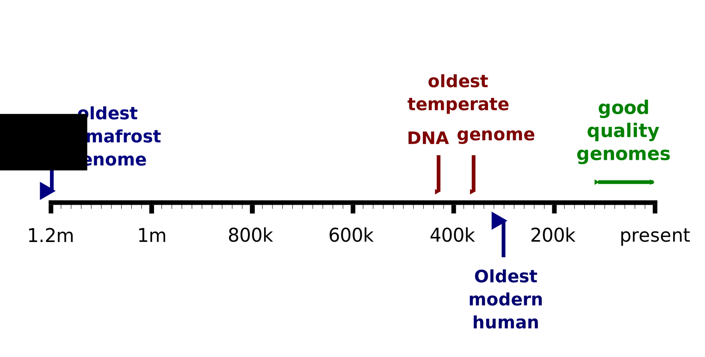
```

--- .segue .dark 

## Ancient DNA is present in trace amounts

---

## Trace amounts

- Ancient samples *typically* contain very small quantities of DNA
- Lab methods optimised for low DNA input
- Sensitive to contamination by modern DNA

```{r, out.width = "70%", dpi = 300, echo = FALSE, fig.align='center'}
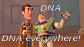
```

--- bg:white

## The ratio is key

```{r, out.width = "100%", fig.width = 5, fig.height = 3, dpi = 600, fig.align = "center", echo = FALSE}

par(mar=c(5,5,1,5))

plot(c(1,2,3), c(10, 3, 1), type="h", axes=FALSE, col=c("blue", "red", "black"), lwd=10,
     xlab="", ylab="DNA amount", ylim=c(0,10)
     )

axis(1, at=c(1,2,3), labels=c("modern", "contamination", "ancient"))
```

--- bg:white

## The ratio is key

```{r, out.width = "100%", fig.width = 5, fig.height = 3, dpi = 600, fig.align = "center", echo = FALSE}

par(mar=c(5,5,1,5))

plot(c(1,2,3), c(10, 0.1, 1), type="h", axes=FALSE, col=c("blue", "red", "black"), lwd=10,
     xlab="", ylab="DNA amount", ylim=c(0,10)
     )

axis(1, at=c(1,2,3), labels=c("modern", "contamination", "ancient"))

```

---

## PCR lab is especially dangerous

```{r, out.width = "100%", dpi = 300, echo = FALSE, fig.align='center'}
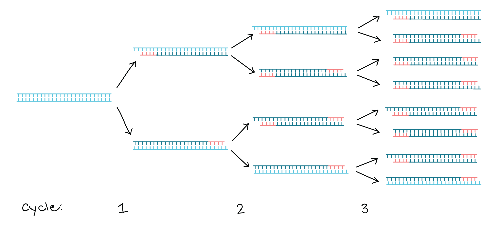
```

--- 

## Ancient DNA lab (clean lab)

- Geographically separated from modern lab
- Strict decontamination procedures (bleach, UV)
- Protective clothing
- Control of flow people and materials into lab (avoiding modern)
- Separated work areas for different procedures

---

## Smurfs

```{r, out.width = "75%", dpi = 300, echo = FALSE, fig.align='center'}
include_graphics("./assets/img/sina_lab.jpg")
```

---

## Example lab layout

```{r, out.width = "85%", dpi = 300, echo = FALSE, fig.align='center'}
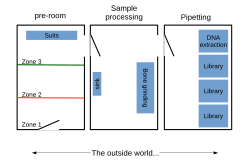
```

--- bg:white

## DNA extraction

```{r, out.width = "65%", dpi = 300, echo = FALSE, fig.align='center'}
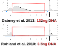
```

--- .segue .dark 

## Ancient DNA is highly fragmented

--- &twocol bg:white

## Ancient DNA fragment length distribution

- DNA in ancient samples is highly fragmented
- The fragment lengths have a **skewed distribution**

*** =left

```{r, out.width = "100%", out.height = "100%", fig.width = 8, fig.height = 7, dpi = 600, fig.align = "center", echo = FALSE}
# function for calculating mode
getmode <- function(v) {
   uniqv <- unique(v)
   uniqv[which.max(tabulate(match(v, uniqv)))]
}

adna <- read.table("./assets/data/HV74-Dab-SS_S12_dataset1_rld.txt", header=TRUE)

plot <- ggplot(adna) +
  geom_histogram(aes(x=bp), fill="lightgrey", colour="black", show.legend=TRUE, bins = 30) +
  theme_bw(base_size = 25)+
  labs(x="DNA fragment length (bp)", y="count")

plot
```
*** =right

```{r, out.width = "100%", dpi = 300, , echo = FALSE}
include_graphics("./assets/img/kudarensis.png")
```

45 ka cave bear (*Ursus kudarensis*)

--- 

## DNA extraction

```{r, out.width = "100%", out.height=500, dpi = 300, echo = FALSE}
include_graphics("./assets/img/Dabney et al. - 2013 - Complete mitochondrial genome sequence of a Middle.pdf")
```

---

## PCR issues

```{r, out.width = "%", dpi = 300, echo = FALSE, fig.align='center'}
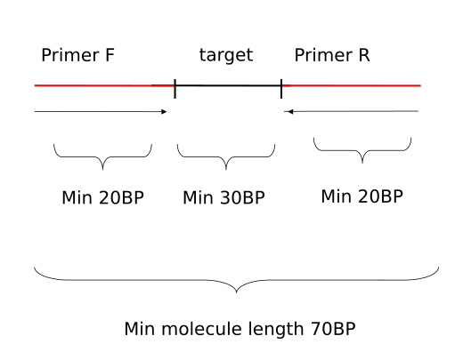
```

---

## Not a problem for NGS

```{r, out.width = "100%", dpi = 300, echo = FALSE, fig.align = "center"}
  include_graphics("./assets/img/library_molecule.svg")
```

--- .segue .dark 

## Ancient DNA data has high error rates

--- &vcenter

## Typical ancient DNA molecule

```{r, out.width = "100%", dpi = 300, echo = FALSE, fig.align = "center"}
  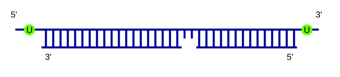
```

---

## Cytosine deamination

```{r, out.width = "90%", dpi = 300, echo = FALSE, fig.align = "center"}
  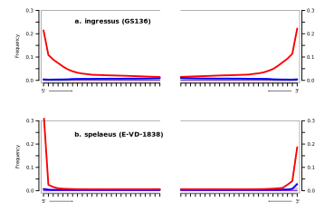
```

---

## Ancient DNA sequencing error

- **Cytosine deamination**
- Polymerase errors
- Other things we don't fully understand yet

### All these are sequenced with high quality, and amplified by the typically low coverage of ancient DNA data

---

## Error correction

```{r, out.width = "85%", dpi = 300, echo = FALSE, fig.align = "center"}
  
```

--- .segue .dark 

## Ancient DNA is highly contaminated

---

## First measurement of endogenous content

```{r, out.width = "100%", out.height=500, dpi = 300, echo = FALSE}
include_graphics("./assets/img/Noonan et al. - 2005 - Genomic Sequencing of Pleistocene Cave Bears.pdf")
```

---

## Contamination

- Around 1% endogenous content is considered typical
- Not really a problem for PCR (except humans)
- THE major problem for NGS

### Several methods exist for reducing the contaminant fraction

--- &vcenter

## DNA hybridisation capture*

```{r, out.width = "90%", dpi = 300, echo = FALSE}
include_graphics("./assets/img/hybr.svg")
```

### *Of course this only works if you know the sequence in advance

---

## Sample pretreatment

```{r, out.width = "90%", dpi = 300, echo = FALSE}
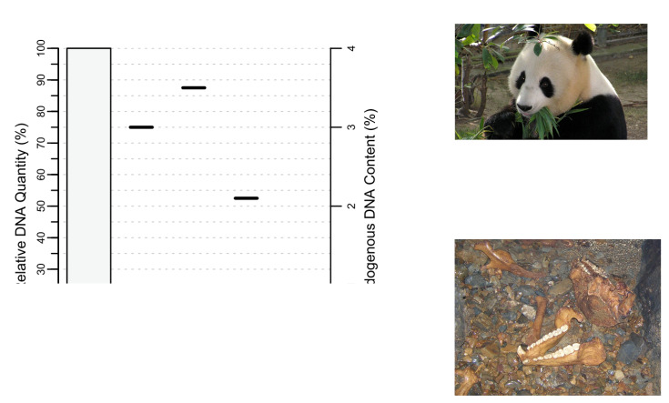
```

---

## Just sequence it (if you can afford it)

```{r, out.width = "90%", dpi = 300, echo = FALSE}
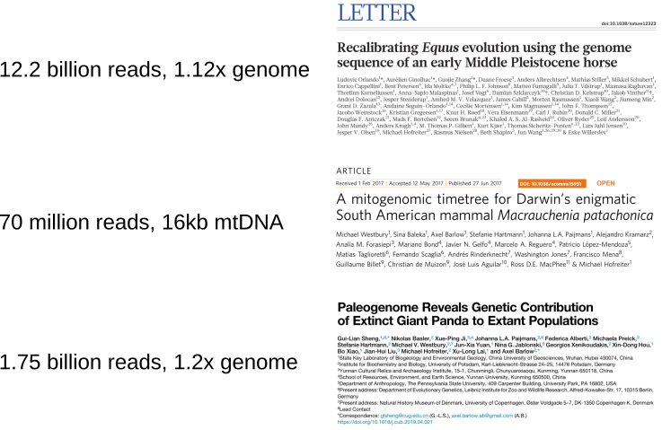
```

--- &twocol

## Selecting the right sample

*** =left

```{r, out.width = "100%", dpi = 300, echo = FALSE}
  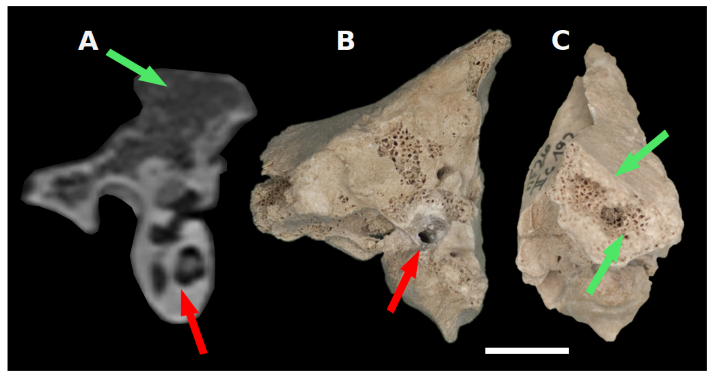
```

```{r, out.width = "50%", dpi = 300, echo = FALSE, fig.align = "center"}
  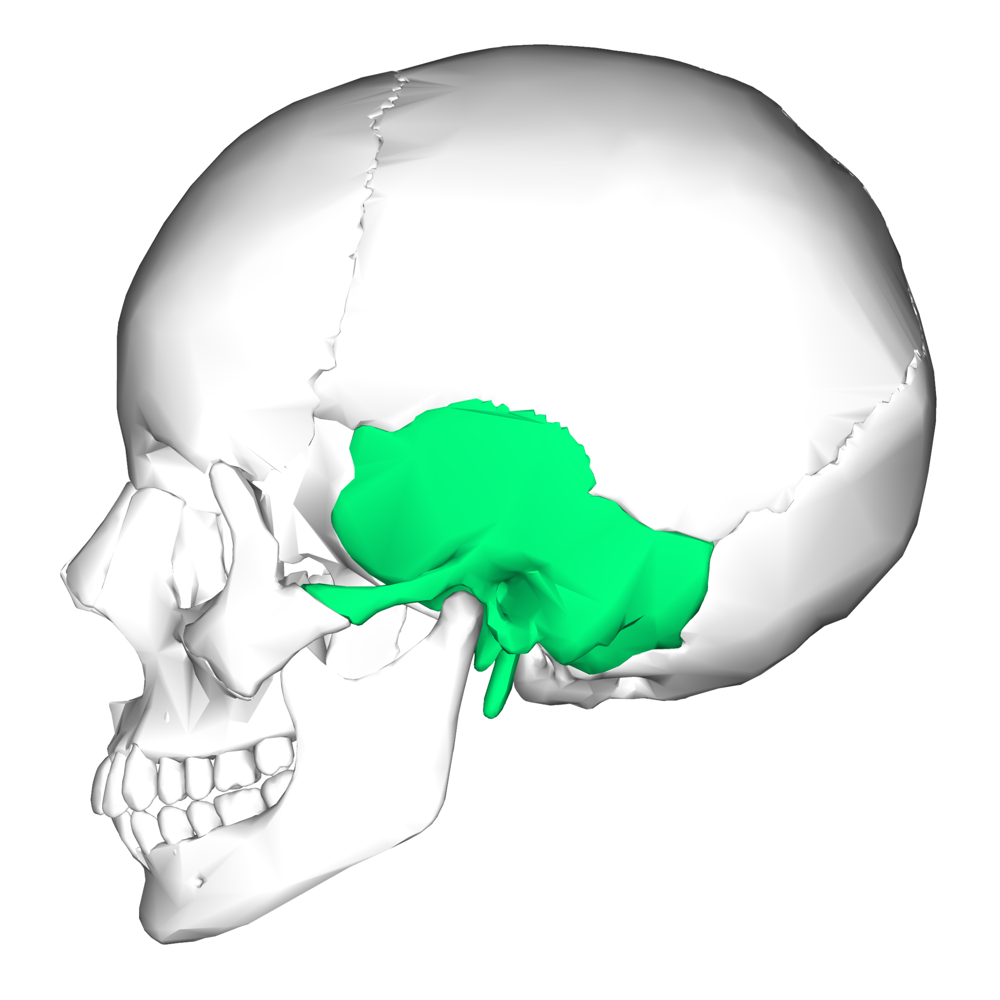
```
*Anatomography CC BY-SA 2.1 JP*

*** =right

```{r, out.width = "100%", out.height = "100%", fig.width = 8, fig.height = 7, dpi = 600, fig.align = "center", echo = FALSE}
my_dat <- read.table("./assets/data/petrous_endo", header=TRUE)

my_plot <- ggplot(my_dat, aes(sample, endo, fill=region)) +
  geom_bar(position=position_dodge(), stat="identity", colour="black") +
  scale_fill_manual(values=c("#ff0000ff", "#94f0a3ff")) +
  theme_bw(base_size = 25) +
  xlab("")+
  ylab("Endogenous %") +

 theme(
    panel.grid.major = element_blank(),
    panel.grid.minor = element_blank(),
  )

my_plot
```

--- &vcenter

## Selecting the right sample

```{r, out.width = "60%", dpi = 300, echo = FALSE, fig.align = "center"}
  include_graphics("./assets/img/outermost_layer.png")
```

---

## Suggested reading

```{r, out.width = "100%", out.height=500, dpi = 300, echo = FALSE}
include_graphics("./assets/img/Orlando_2021.pdf")
```

--- &thankyou

## Next time:

**Ancient DNA 2**
