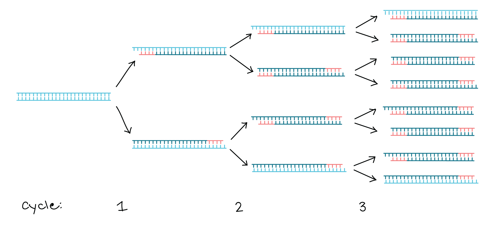
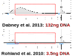
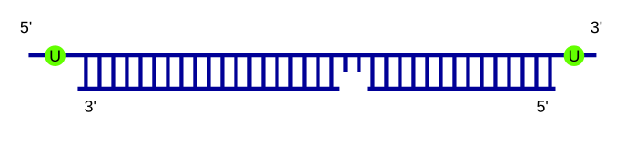
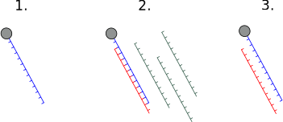
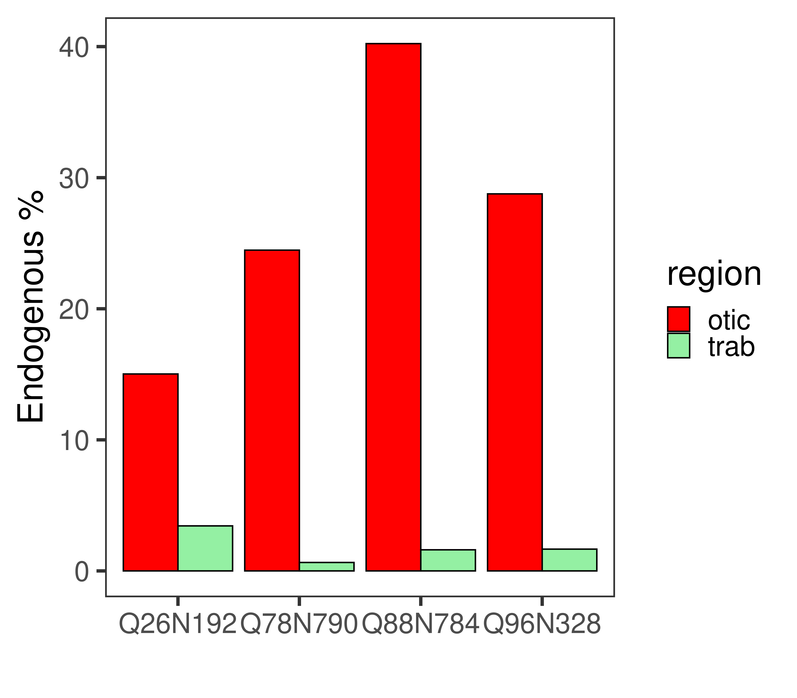

<!-- adding bold and italic options -->

## Ancient DNA

- Why study ancient DNA?
- A brief history of the field
- Propoerties of ancient DNA, challenges and solutions

--- &twocol

## Ancient DNA is just old DNA

*** =left

- Bones
- Teeth
- Permafrost carcasses/"mummies"
- Museum specimens
- Sediments
- Dental calculus
- Coprolites

*** =right

--- bg:white

## Why study ancient DNA?

--- .segue .dark 

## A brief history

--- 

## The field is < 40 years old

<embed src="./assets/img/Higuchi_1984_Quagga.pdf" title="plot of chunk unnamed-chunk-4" width="100%" height="500" type="application/pdf" />

--- 

## There have been some spectacular failures

<embed src="./assets/img/Paabo_1985_mummy.pdf" title="plot of chunk unnamed-chunk-5" width="100%" height="500" type="application/pdf" />

--- 

## Sorry dinosaur fans...

<embed src="./assets/img/Cano_1993_weevil.pdf" title="plot of chunk unnamed-chunk-6" width="100%" height="500" type="application/pdf" />

--- 

## Sorry dinosaur fans...

<embed src="./assets/img/Woodward_1994_dino.pdf" title="plot of chunk unnamed-chunk-7" width="100%" height="500" type="application/pdf" />

--- 

## First Pleistocene DNA

--- 

## First Pleistocene DNA

<embed src="./assets/img/Hagelberg_1994_mammoth.pdf" title="plot of chunk unnamed-chunk-9" width="100%" height="500" type="application/pdf" />

--- 

## First Pleistocene mitochondrial genome

<embed src="./assets/img/Krause_2005_mammoth.pdf" title="plot of chunk unnamed-chunk-10" width="100%" height="500" type="application/pdf" />

--- 

## First palaeogenome

<embed src="./assets/img/miller_2008_mammoth.pdf" title="plot of chunk unnamed-chunk-11" width="100%" height="500" type="application/pdf" />

--- 

## The present

<embed src="./assets/img/bergstrom_2022_wolves.pdf" title="plot of chunk unnamed-chunk-12" width="100%" height="500" type="application/pdf" />

--- .segue .dark 

## Properties of ancient DNA

---

## Properties of ancient DNA

- Present in trace amounts
- Fragmentation
- High rates of sequencing error
- Contamination

**These are temporal processes**

--- 

## Timeline of ancient DNA

--- .segue .dark 

## Ancient DNA is present in trace amounts

---

## Trace amounts

- Ancient samples *typically* contain very small quantities of DNA
- Lab methods optimised for low DNA input
- Sensitive to contamination by modern DNA

--- bg:white

## The ratio is key

--- bg:white

## The ratio is key

---

## PCR lab is especially dangerous

--- 

## Ancient DNA lab (clean lab)

- Geographically separated from modern lab
- Strict decontamination procedures (bleach, UV)
- Protective clothing
- Control of flow people and materials into lab (avoiding modern)
- Separated work areas for different procedures

---

## Smurfs

---

## Example lab layout

--- bg:white

## DNA extraction

--- .segue .dark 

## Ancient DNA is highly fragmented

--- &twocol bg:white

## Ancient DNA fragment length distribution

- DNA in ancient samples is highly fragmented
- The fragment lengths have a **skewed distribution**

*** =left

*** =right

45 ka cave bear (*Ursus kudarensis*)

--- 

## DNA extraction

<embed src="./assets/img/Dabney et al. - 2013 - Complete mitochondrial genome sequence of a Middle.pdf" title="plot of chunk unnamed-chunk-24" width="100%" height="500" type="application/pdf" />

---

## PCR issues

---

## Not a problem for NGS

--- .segue .dark 

## Ancient DNA data has high error rates

--- &vcenter

## Typical ancient DNA molecule

---

## Cytosine deamination

---

## Ancient DNA sequencing error

- **Cytosine deamination**
- Polymerase errors
- Other things we don't fully understand yet

### All these are sequenced with high quality, and amplified by the typically low coverage of ancient DNA data

---

## Error correction

--- .segue .dark 

## Ancient DNA is highly contaminated

---

## First measurement of endogenous content

<embed src="./assets/img/Noonan et al. - 2005 - Genomic Sequencing of Pleistocene Cave Bears.pdf" title="plot of chunk unnamed-chunk-30" width="100%" height="500" type="application/pdf" />

---

## Contamination

- Around 1% endogenous content is considered typical
- Not really a problem for PCR (except humans)
- THE major problem for NGS

### Several methods exist for reducing the contaminant fraction

--- &vcenter

## DNA hybridisation capture*

### *Of course this only works if you know the sequence in advance

---

## Sample pretreatment

---

## Just sequence it (if you can afford it)

--- &twocol

## Selecting the right sample

*** =left

*Anatomography CC BY-SA 2.1 JP*

*** =right

--- &vcenter

## Selecting the right sample

---

## Suggested reading

<embed src="./assets/img/Orlando_2021.pdf" title="plot of chunk unnamed-chunk-38" width="100%" height="500" type="application/pdf" />

--- &thankyou

## Next time:

**Ancient DNA 2**
